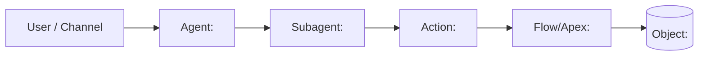

# Solution Blueprint — <project>

> Owned by 🧭 The Orchestrator Agent. Living map of what exists. Reconciled against the org in phase 11 — reflects what is **deployed**, not what was planned.

## 1. Header

| Field | Value |
|---|---|
| Project | <project name> |
| Target org(s) | <alias> (<type>) |
| Channel | <Employee / MIAW / Experience Cloud / Voice / Slack / API> |
| RAG status | <none / Data 360 existing / Data 360 new / ADL> |
| Repo / branch | <owner/repo> · <feature branch> |
| PRD | PRD-<solution>.md v<n> (approved <date>) |
| Current phase | <1–12 name> |
| Last updated | <YYYY-MM-DD> by <agent> |

## 2. Architecture diagram

## 3. Component inventory

| Component | Type | API name | Path | Owner phase | Status |
|---|---|---|---|---|---|
| | | | | | planned / built / tested / deployed-<org> |

## 4. Manual org-config steps (not in metadata)

| # | Step | Org | Who | When | Verified (how) |
|---|---|---|---|---|---|
| 1 | | | user | before build | |

## 5. Rebuild-in-a-new-org checklist

1. Authenticate: `sf org login web --alias <alias>`
2. Complete manual prerequisites (§ 4, steps marked "before deploy")
3. Deploy in dependency order: objects & fields → permission sets → Apex → Flows → Prompt Templates → agent bundle → ESD/Messaging → ExperienceBundle (publish site)
4. Assign permission sets; confirm agent user (`access.default_agent_user`)
5. Publish & activate the agent; verify BotVersion Active
6. Complete manual steps marked "after deploy"
7. Run the eval set (`evals/`) — all cases pass

---

## Loop state

| Case (test / eval / incident ID) | Bounces | Last route | Status |
|---|---|---|---|

## Rollback path

> Written by 🚀 The Shipper Agent before every tier 2/3 deploy.

- Prior BotVersion: <id / version>
- Pre-release snapshot: `releases/<date>-<org>/pre/`
- Destructive manifest for additions: `releases/<date>-<org>/destructiveChanges.xml`
- Steps: re-activate prior BotVersion → restore snapshot → destructive-deploy additions → verify

## Release history

| Date | Org | From SHA | Agent version | Deploy/job ID | Result |
|---|---|---|---|---|---|
